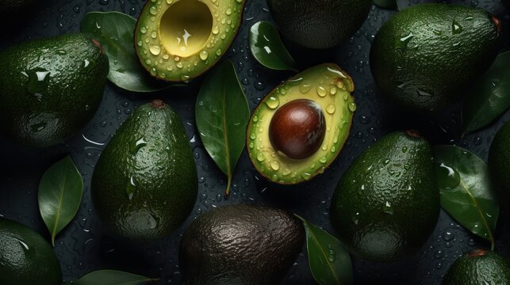
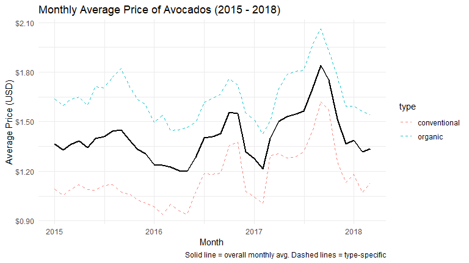
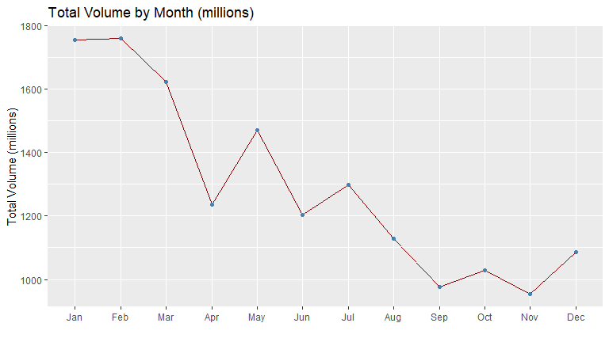
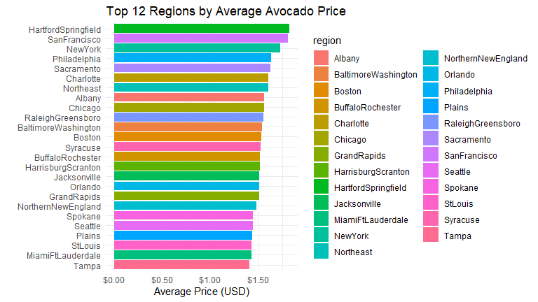
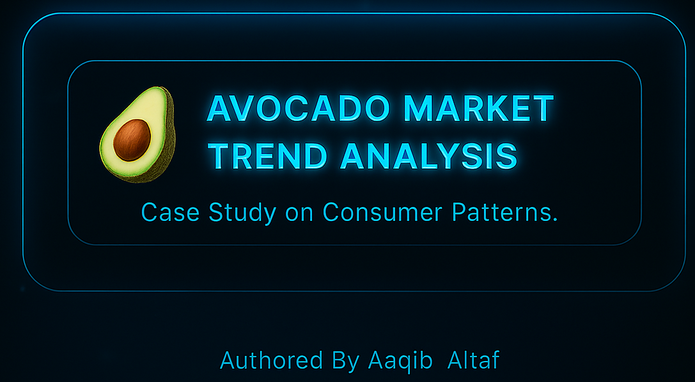

<h1 align="center">
 🥑 Avocado Market Trend Analysis Case Study  
</h1>

<h1 align="center" style="font-family:'Segoe UI',sans-serif; color:#81C784;">
 
</h1>

  

    

  
  

---

## 📘 Overview
This case study explores **avocado market trends in the United States**, focusing on **average prices, sales volumes, and regional patterns**.  
The objective is to analyze how **seasonality, geography, and consumer preference** influence the avocado market using real-world retail data.

The analysis was performed as part of the **Google Data Analytics Professional Certificate**, demonstrating applied skills in **data cleaning, visualization, and storytelling using R and spreadsheets**.

---

##  Objectives
1. Identify **price and demand trends** over time.  
2. Compare **regional market differences** for avocados.  
3. Understand the correlation between **volume and price movements**.  
4. Communicate insights effectively through **data visualization and reports**.

---

##  Key Insights
- **Prices exhibit seasonality** — higher around Q4 each year, likely due to holidays and demand spikes.  
- **Volume inversely correlates with price**, suggesting demand elasticity in the market.  
- **California and West regions dominate** in both price and sales volume.  
- **Organic avocados** show a smaller market share but higher average prices.

---

---

## 🧱 Stack Architecture

  

  

  

  

  

  

---

##  Visual Analytics

| Visualization | Description |
|:--------------|:-------------|
| **📈 Monthly Average Price Trend** | Displays overall avocado price movements per month across years. |
| **📦 Monthly Average Volume Trend** | Illustrates supply variations and demand surges. |
| **📍 Top 12 Regions by Average Price** | Highlights market diversity and regional pricing differences. |

  
  

  

---

<h2 align="center">🧰 Tools & Techniques</h2>

<table align="center">
  <tr>
    <th align="center" width="150" style="background-color:#1a1a1a;color:#00e6b8;">Tool</th>
    <th align="center" style="background-color:#1a1a1a;color:#00e6b8;">Purpose</th>
  </tr>
  <tr>
    <td align="center" style="background-color:#0d1117;">
       <b>R / RStudio</b>
    </td>
    <td style="background-color:#0d1117;color:#e6e6e6;">Data cleaning, wrangling, and visualization</td>
  </tr>
  <tr>
    <td align="center" style="background-color:#0d1117;">
       <b>ggplot2</b>
    </td>
    <td style="background-color:#0d1117;color:#e6e6e6;">Plotting trends and comparative analytics</td>
  </tr>
  <tr>
    <td align="center" style="background-color:#0d1117;">
       <b>Excel / Google Sheets</b>
    </td>
    <td style="background-color:#0d1117;color:#e6e6e6;">Quick EDA and cross-checking calculations</td>
  </tr>
  <tr>
    <td align="center" style="background-color:#0d1117;">
       <b>Markdown & GitHub</b>
    </td>
    <td style="background-color:#0d1117;color:#e6e6e6;">Report documentation and version control</td>
  </tr>
</table>

---

##  Methodology
1. **Data Collection:** Avocado dataset sourced from *Hass Avocado Board* via Kaggle.  
2. **Data Cleaning:** Removed duplicates, handled missing entries, formatted date columns.  
3. **Processing:** Aggregated by region, month, and year for trend observation.  
4. **Visualization:** Built charts to identify demand patterns and anomalies.  
5. **Insight Reporting:** Highlighted actionable trends and summarized findings.

---

## 💡 Conclusion
The Avocado Market Trend Analysis demonstrates how **data-driven insights** can improve **pricing, logistics, and inventory decisions** in agribusiness.  
This study validates the power of **Google Data Analytics methodology**—from *Ask → Prepare → Process → Analyze → Share → Act*—in real-world applications.

<h2 align="center"> Click Below To Explore Full Interactive Report</h2>

  

  <b>“Turning raw data into insightful stories — one avocado at a time.”</b>  
    — <i>Prepared and Documented by Aakif Altaf</i>

